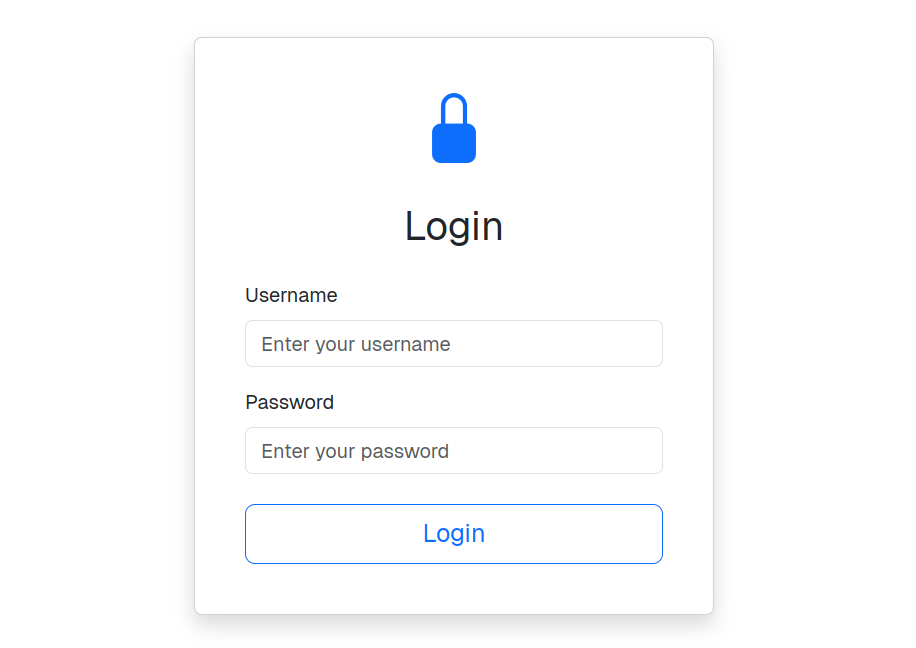
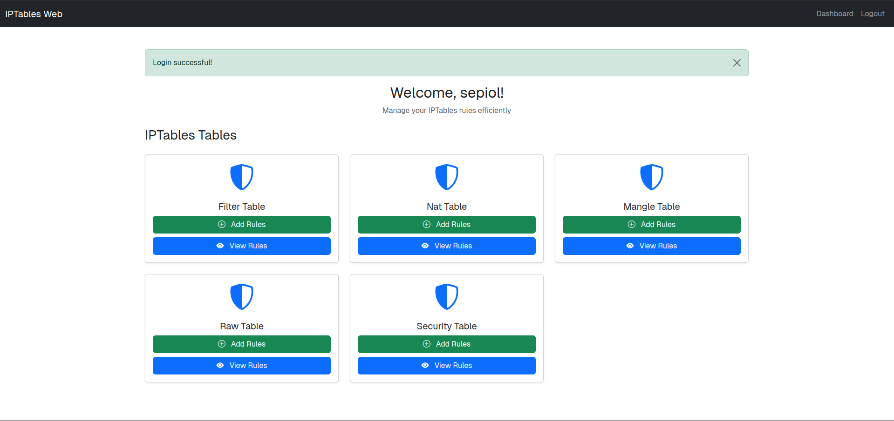
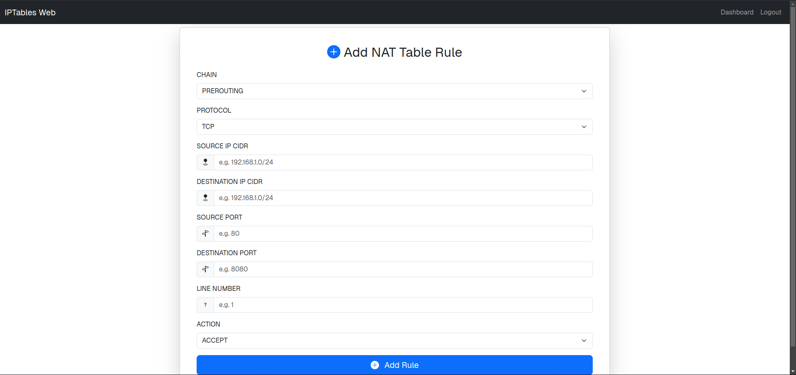
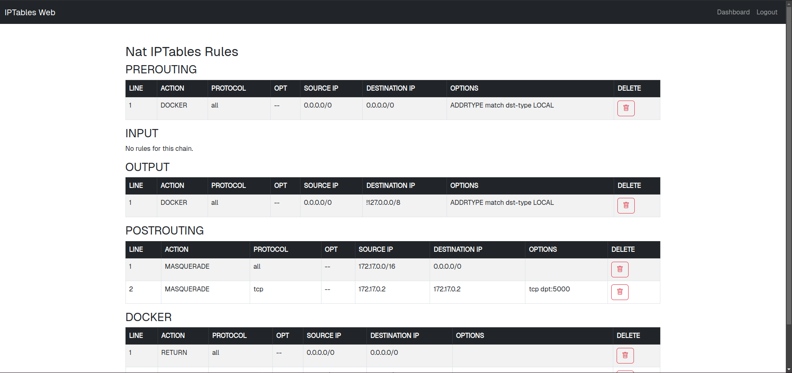

# **Web interface for rule management for IPtables**

For now,rules can be viewed,deleted and added

Currently supported on ubuntu and debian

To start the app

```
git clone https://github.com/Swaminathan007/iptables-gui.git
sudo chmod +x setup.sh
sudo ./setup.sh
```


## Login Page:




## Dashboard Page:




## Add Rule Page:




## View Rule page:



